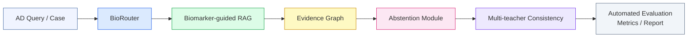

# BioContextAD

> **Biomarker-Guided Context Engineering for Alzheimer's Disease Early Screening**

[](https://www.python.org/)
[](LICENSE)
[](https://github.com/ShengAnlin/BioContextAD)

> ⚠️ **Disclaimer**: This repository is a research prototype for academic exploration only. It is **not** a clinical diagnostic tool and should **not** be used for medical decision-making.

---

## Overview

**BioContextAD** is a proof-of-concept framework that integrates biomarker-guided context engineering with large language models (LLMs) for Alzheimer's disease (AD) early screening. Rather than relying on unconstrained LLM inference, the system routes queries through a structured biomarker-aware pipeline to improve evidence grounding and safety.

### Pipeline Architecture



### Core Modules

| Module | Role | Key Metric |
|---|---|---|
| **BioRouter** | Query classification across AD pathological axes (A/T/N/I/V + OTHER) | Macro-F1 |
| **Biomarker-guided RAG** | Evidence retrieval anchored to AD biomarker categories | Evidence Relevance Score |
| **Abstention Module** | Safety control for unanswerable or unsafe queries | Abstention F1 |
| **Evidence Graph** | Lightweight knowledge graph linking biomarkers and findings | Node/Edge Coverage |
| **Multi-teacher Consistency** | Cross-model agreement for answer reliability | Agreement Rate (κ) |
| **Evaluation Pipeline** | Automated metrics, error case analysis, weekly report | — |

---

## AD Biomarker Axes (NIA-AA ATNIV Framework)

The routing and retrieval system is anchored to five pathological axes:

- **A** — Amyloid (Aβ42/Aβ40, CSF/PET/plasma)
- **T** — Tau (p-tau181/217/231, NFT)
- **N** — Neurodegeneration (NfL, GFAP, MRI atrophy)
- **I** — Inflammation / Immunity (microglia, astrocyte, neuroinflammation)
- **V** — Vascular contribution (vascular dysfunction, WMH)
- **OTHER** — Risk factors, cognitive scales, APOE ε4

---

## Quick Start

```bash
# 1. Clone
git clone https://github.com/ShengAnlin/BioContextAD.git
cd BioContextAD

# 2. Install dependencies
conda env create -f environment.yml
conda activate biocontextad
# or: pip install -r requirements.txt

# 3. Configure API keys
cp .env.example .env
# Edit .env and fill in your API keys

# 4. Run the full pipeline
bash scripts/run_all.sh
```

Results will be saved to `results/`. A Markdown summary report is generated at `results/weekly_report.md`.

---

## Repository Structure

```
BioContextAD/
├── configs/
│   ├── models.yaml          # Model role assignments
│   └── axes.yaml            # AD pathological axis definitions
├── data/
│   ├── eval_questions.jsonl # Evaluation questions (seed set)
│   └── evidence_pairs.jsonl # (claim, evidence) pairs for ranking
├── prompts/
│   ├── router_prompt.md     # BioRouter system prompt
│   ├── rag_prompt.md        # Biomarker-guided RAG prompt
│   ├── abstention_prompt.md # Abstention/safety prompt
│   └── evidence_prompt.md   # Evidence extraction prompt
├── src/
│   ├── llm_client.py        # Unified LLM interface with caching & retry
│   ├── run_e1.py            # Experiment 1: BioRouter evaluation
│   ├── run_e3.py            # Experiment 3: Evidence ranking
│   ├── metrics.py           # Macro-F1, Fleiss' κ, confusion matrix
│   └── report.py            # Automated 6-section weekly report
├── notebooks/
│   └── exploration.ipynb    # EDA and result visualization
├── docs/
│   └── architecture.md      # Detailed pipeline documentation
├── scripts/
│   └── run_all.sh           # End-to-end pipeline runner
├── results/                 # Output directory (gitignored except .gitkeep)
├── environment.yml
├── requirements.txt
└── .env.example
```

---

## Experimental Setup

### Phase 1 (Dry-run)

| Experiment | Cases | Models | Primary Metric |
|---|---|---|---|
| E1: BioRouter | 30–50 | DeepSeek-V4-Flash / Qwen3.5-27B | Macro-F1 |
| E2: Abstention | 20 | Claude / DeepSeek-V4-Pro | Abstention F1 |
| E3: RAG | 30–50 | Claude / GPT / Baichuan-M3 | Evidence Relevance |
| E4: Multi-teacher | 20–30 × 3 | Claude + Baichuan-M3 + Qwen | Agreement Rate (κ) |

### Ablation Conditions

| Condition | Description |
|---|---|
| Full pipeline | BioRouter + Biomarker RAG + Abstention |
| No-router | Vanilla RAG without axis routing |
| No-biomarker | Generic RAG without biomarker anchoring |
| No-abstention | Pipeline without safety/uncertainty gate |
| Vanilla RAG | Standard RAG baseline |

---

## Technical Design

### Unified LLM Interface

All API calls go through a single `call_llm(model_role, prompt, temperature)` interface:

- **Caching**: Results stored at `results/raw/{task}/{sample_id}_{model}.json`
- **Retry**: Exponential backoff with 3 retries
- **Fallback**: Configurable fallback model per role
- **Logging**: All failures logged to `logs/errors.log`

### API Role Assignments

| Role | Model |
|---|---|
| Reasoning / Writing | Claude / GPT-4.1 |
| Medical Teacher | Baichuan-M3 / DeepSeek-V4-Pro |
| Batch Baseline | DeepSeek-V4-Flash / Qwen3.5-27B |
| Structured Output | Qwen3.6-Plus |
| Long-doc / Report | Kimi-K2.6 / MiniMax-M2.5 |

---

## Paper Contributions

This work makes three core contributions:

1. A **biomarker-guided context engineering framework** for AD early screening that anchors LLM retrieval to the NIA-AA ATNIV pathological axes.
2. A **BioRouter + Abstention** mechanism for routing AD queries across pathological categories and constraining unsafe or unanswerable inference.
3. An **evidence-grounded evaluation pipeline** integrating RAG, lightweight knowledge graph construction, and multi-teacher consistency scoring.

---

## Citation

If you find this work useful, please cite:

```bibtex
@misc{sheng2026biocontextad,
  title  = {BioContextAD: Biomarker-Guided Context Engineering for Alzheimer's Disease Early Screening},
  author = {Sheng, Anlin},
  year   = {2026},
  url    = {https://github.com/ShengAnlin/BioContextAD}
}
```

---

## License

This project is licensed under the MIT License. See [LICENSE](LICENSE) for details.

> **Research use only.** This framework is intended for academic research and is not validated for clinical use. All outputs should be interpreted by qualified medical professionals.
