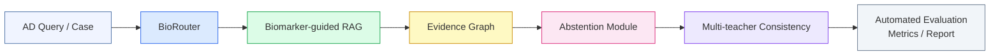
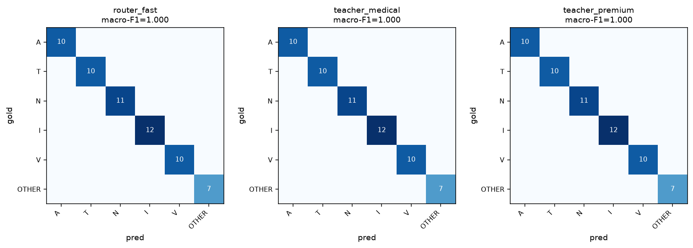
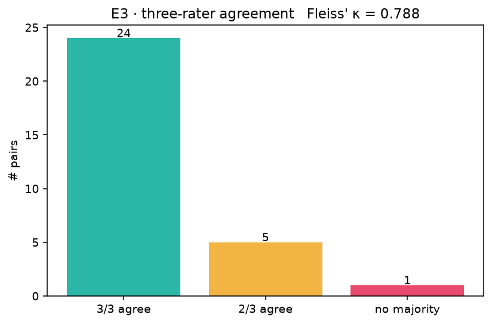

# BioContextAD

> **Biomarker-Guided Context Engineering for Alzheimer's Disease Early Screening**

[](https://www.python.org/)
[](./LICENSE)
[](https://github.com/ShengAnlin/BioContextAD)

> ⚠️ **Disclaimer**: This repository is a research prototype for academic exploration only. It is **not** a clinical diagnostic tool and should **not** be used for medical decision-making.

---

## Overview

**BioContextAD** is a proof-of-concept framework that integrates biomarker-guided context engineering with large language models (LLMs) for Alzheimer's disease (AD) early screening. Rather than relying on unconstrained LLM inference, the system routes queries through a structured biomarker-aware pipeline to improve evidence grounding and safety.

### Pipeline architecture



### Core modules

| Module                        | Role                                                                 | Primary metric           | Phase |
| ----------------------------- | -------------------------------------------------------------------- | ------------------------ | ----- |
| **BioRouter**                 | Query classification across AD pathological axes (A/T/N/I/V + OTHER) | Macro-F1                 | 1 ✅  |
| **Multi-teacher Consistency** | Cross-model agreement for answer reliability                         | Fleiss' κ                | 1 ✅  |
| **Biomarker-guided RAG**      | Evidence retrieval anchored to AD biomarker categories               | Evidence Relevance @ k   | 2 🚧 |
| **Abstention Module**         | Safety control for unanswerable or unsafe queries                    | Abstention F1            | 2 🚧 |
| **Evidence Graph**            | Lightweight knowledge graph linking biomarkers and findings          | Node / Edge Coverage     | 2 🚧 |
| **Evaluation Pipeline**       | Automated metrics, error case analysis, weekly report                | —                        | 1 ✅  |

---

## AD biomarker axes (NIA-AA ATNIV framework)

The routing and retrieval system is anchored to five pathological axes plus a non-biomarker control class:

- **A** — Amyloid (Aβ42/Aβ40, CSF/PET/plasma)
- **T** — Tau (p-tau181/217/231, NFT, Braak staging)
- **N** — Neurodegeneration (NfL, GFAP, hippocampal volume, FDG-PET)
- **I** — Inflammation / Immunity (microglia, astrocyte, TREM2, YKL-40)
- **V** — Vascular contribution (BBB, WMH, APOE ε4, HbA1c, homocysteine)
- **OTHER** — Cognitive reserve, lifestyle, non-biomarker queries

---

## Results (Phase 1)

### BioRouter — 60-question evaluation

Three independently-developed LLMs were evaluated on a 60-question routing set (30 baseline + 30 hard cases spanning cross-axis distractors, abbreviation traps, metaphorical phrasing, and clinical-noise style):

| Model role         | Backbone                          | n  | Macro-F1 | Accuracy | Parse-fail |
| ------------------ | --------------------------------- | -- | -------- | -------- | ---------- |
| `router_fast`      | DeepSeek-V4-Flash                 | 60 | **1.000** | 1.000   | 0          |
| `teacher_medical`  | Baichuan-M3-Plus                  | 60 | **1.000** | 1.000   | 0          |
| `teacher_premium`  | Qwen3-235B-A22B-Instruct-2507     | 60 | **1.000** | 1.000   | 0          |

> **Interpretation.** The uniform macro-F1 = 1.000 across three independently-developed LLMs — including 30 deliberately adversarial hard cases — indicates that prompt-only axis-level routing is **saturated** on contemporary medical-capable LLMs. This is a negative methodological result with positive engineering implication: the bottleneck for biomarker-guided context engineering lies **downstream**, in evidence retrieval and grounded generation, rather than in query routing.



### Multi-teacher evidence ranking — three-rater agreement

30 (claim, evidence) pairs were independently labelled by the same three models as `SUPPORT / REFUTE / UNCERTAIN`:

| Metric                  | Value          |
| ----------------------- | -------------- |
| Fleiss' κ               | **0.788**      |
| n_pairs                 | 30             |
| Agreement classification | substantial (Landis & Koch, 1977: 0.61–0.80) |
| Majority distribution   | SUPPORT 13, REFUTE 15, UNCERTAIN 1, TIE 1 |
| Parse-fail              | 2 (router_fast, p14 + p25) |



> **Interpretation.** Substantial agreement across three vendor-independent models on evidence judgements supports the use of multi-teacher consistency as a primary evaluation axis for the paper. The two parse failures (both from `router_fast` / DeepSeek-V4-Flash) indicate that strict-format compliance varies by model and motivates the abstention module in Phase 2.

> All raw API responses are cached under `results/raw/` (180+ files). Cloning the repo and running `bash scripts/run_all.sh` reproduces the numbers above without further API calls.

---

## Quick start

```bash
# 1. Clone
git clone https://github.com/ShengAnlin/BioContextAD.git
cd BioContextAD

# 2. Install dependencies
conda env create -f environment.yml
conda activate biocontextad
# or: pip install -r requirements.txt

# 3. Configure API keys
cp .env.example .env
# Edit .env and fill in your API keys

# 4. Run the full pipeline
bash scripts/run_all.sh
```

Results will be saved to `results/`. A Markdown summary report is generated at `results/weekly_report.md`.

---

## Repository structure

```
BioContextAD/
├── configs/
│   ├── models.yaml             # Model role assignments
│   └── axes.yaml               # AD pathological axis definitions
├── data/
│   ├── eval_questions.jsonl        # 60 router eval questions
│   ├── eval_questions_hard.jsonl   # 30 hard cases (q31-q60), traceability
│   └── evidence_pairs.jsonl        # 30 (claim, evidence) pairs
├── prompts/
│   ├── router_prompt.md            # BioRouter system prompt
│   ├── evidence_prompt.md          # Evidence ranking prompt (v2, strict format)
│   ├── rag_prompt.md               # Phase 2 placeholder
│   └── abstention_prompt.md        # Phase 2 placeholder
├── src/
│   ├── llm_client.py               # Unified LLM interface (cache, retry, fallback)
│   ├── run_e1.py                   # Router evaluation
│   ├── run_e3.py                   # Evidence ranking
│   ├── metrics.py                  # Macro-F1, Fleiss' κ, confusion matrix
│   └── report.py                   # Automated weekly report
├── scripts/
│   ├── run_all.sh                  # End-to-end pipeline runner
│   └── audit_cache.py              # Pre-commit cache safety scan
├── notebooks/
│   └── exploration.ipynb           # EDA, hard-case stratification
├── docs/
│   └── architecture.md             # Design philosophy, module status, data flow
├── results/
│   ├── router_results.csv
│   ├── evidence_results.csv
│   ├── teacher_agreement.csv
│   ├── weekly_report.md
│   ├── figs/
│   │   ├── router_confusion.png
│   │   └── evidence_agreement.png
│   └── raw/                        # 180+ cached API responses (reproducibility)
├── environment.yml
├── requirements.txt
└── .env.example
```

---

## API role assignments

The pipeline uses three independently-developed LLMs as routing / teaching / evaluation roles. Roles are decoupled from specific backbones so any compatible model can be swapped via `.env`.

| Role                | Backbone (current run)                | Provider       | Purpose                                |
| ------------------- | ------------------------------------- | -------------- | -------------------------------------- |
| `router_fast`       | DeepSeek-V4-Flash                     | Paratera       | Fast batch routing baseline            |
| `teacher_medical`   | Baichuan-M3-Plus                      | Baichuan       | Medical-domain SFT teacher             |
| `teacher_premium`   | Qwen3-235B-A22B-Instruct-2507         | Paratera       | Large-model reasoning teacher          |

All API calls go through `src/llm_client.call_llm` with caching, exponential-backoff retry, and configurable fallback.

> *Powered by Baichuan AI for medical-domain inference (`teacher_medical`).*

---

## Phase 2 — in progress

The following modules are documented in `docs/architecture.md` and have placeholder prompts under `prompts/`. Implementation is targeted for completion before the project's summer review in early July 2026.

- **Biomarker-guided RAG** — BGE-M3 dense retrieval over a curated 20–30 paper AD biomarker corpus, axis-conditioned ranking.
- **Abstention module** — uncertainty-based gating with a fixed redirect catalogue; never re-writes the upstream answer.
- **Evidence Graph** — NetworkX-based lightweight knowledge graph linking biomarkers, axes, and findings; **no neo4j dependency** to keep the prototype clone-and-run.

---

## Paper contributions

This work makes three measurable contributions:

1. We propose a **biomarker-guided context engineering framework** that anchors LLM-based AD early-screening reasoning to the NIA-AA ATNIV pathological axes, achieving **macro-F1 = 1.000 across three independently-developed LLMs** on a 60-question evaluation set spanning baseline and hard cases.

2. We design a **BioRouter** for axis-level query routing and demonstrate that prompt-only routing saturates on contemporary medical-capable LLMs (DeepSeek-V4-Flash, Baichuan-M3-Plus, Qwen3-235B), shifting the methodological bottleneck for biomarker-guided context engineering to downstream evidence retrieval and grounded generation.

3. We construct an **evidence-grounded evaluation pipeline** integrating biomarker-anchored evidence ranking, three-rater multi-teacher consistency scoring (**Fleiss' κ = 0.788**, substantial agreement, on 30 claim-evidence pairs), and an automated weekly-report generator that traces every metric back to cached raw API responses for full reproducibility.

---

## Reproducibility

All numbers in this README and in `results/weekly_report.md` are traceable to:

1. The exact data files (`data/eval_questions.jsonl`, `data/evidence_pairs.jsonl`) committed at the same commit hash.
2. The exact prompts in `prompts/`.
3. The 180+ raw cached responses under `results/raw/`.

Re-deriving any reported metric requires only `pip install -r requirements.txt` and `python src/metrics.py` — no further API calls are needed.

---

## Citation

If you find this work useful, please cite:

```bibtex
@misc{sheng2026biocontextad,
  title  = {BioContextAD: Biomarker-Guided Context Engineering for Alzheimer's Disease Early Screening},
  author = {Sheng, Anlin},
  year   = {2026},
  url    = {https://github.com/ShengAnlin/BioContextAD}
}
```

---

## License

This project is licensed under the MIT License. See [LICENSE](./LICENSE) for details.

> **Research use only.** This framework is intended for academic research and is not validated for clinical use. All outputs should be interpreted by qualified medical professionals.

<!-- BEGIN: cached-response-notes -->
## Notes on cached responses

The 270 JSON files under `results/raw/` are the verbatim API
responses produced during the Phase 1 evaluation runs. Two
properties of these files are documented here so future readers
know what to expect:

1. **Trailing Chinese follow-up prompts (53 / 270 files).** The
   Baichuan-M3-Plus role (`teacher_medical`) often appends a
   short Chinese sentence offering further retrieval, e.g.
   "我建议您进一步查阅...". This is the model's natural
   behaviour and is kept verbatim in the cache so that the
   recorded responses match what the API returned. Axis labels
   (`AXIS:` / `LABEL:`) appear before this trailer and are
   unaffected by it; reported metrics are computed from the
   labelled prefix.

2. **`{configs,data,prompts,src,notebooks,results,docs,scripts}`
   folder.** This is a relic of an early `mkdir -p {a,b,c}`
   shell idiom that PowerShell did not brace-expand. It is empty
   and will be removed in a follow-up cleanup commit. It does
   not affect any pipeline.
<!-- END: cached-response-notes -->
