# Architecture

This document describes the design of the **BioContextAD** pipeline.

> **Status**: Phase 1 (BioRouter + Multi-teacher Consistency) complete.
> Phase 2 (Biomarker-guided RAG + Abstention + Evidence Graph) in progress.

---

## Design philosophy

BioContextAD is **not** a clinical diagnostic system. It is a research prototype
that tests one hypothesis:

> Anchoring LLM reasoning to the NIA-AA ATNIV biomarker framework — through
> explicit query routing, biomarker-aware retrieval, abstention gating, and
> multi-teacher consistency scoring — produces more reproducible and safer
> evidence-grounded outputs than unconstrained LLM inference.

Three engineering principles follow:

1. **Composability over monolith.** Each module (router, RAG, abstention,
   consistency) is a single file under `src/`, callable in isolation and
   composable through a fixed `run_order` in `configs/tasks.yaml`.
2. **Cache before compute.** Every API call is cached at
   `results/raw/{task}/{sample_id}_{role}.json`. Re-runs are free; experiments
   are auditable; cost is bounded.
3. **Statistics over single-model wins.** Routing accuracy is averaged across
   three independently-developed LLMs; evidence ranking is evaluated by Fleiss'
   κ across three raters. Single-model "wins" are not reported.

---

## Pipeline overview

```mermaid
flowchart LR
    Q[AD query / case] --> R[BioRouter<br/>axis classification]
    R -->|A/T/N/I/V/OTHER| RAG[Biomarker-guided RAG<br/>evidence retrieval]
    RAG --> G[Evidence Graph<br/>NetworkX]
    G --> A[Abstention<br/>safety gate]
    A --> C[Multi-teacher<br/>consistency scoring]
    C --> M[Automated metrics<br/>+ weekly report]

    style Q fill:#f0f4ff,stroke:#4a6fa5
    style R fill:#dbeafe,stroke:#2563eb
    style RAG fill:#dcfce7,stroke:#16a34a
    style G fill:#fef9c3,stroke:#ca8a04
    style A fill:#fce7f3,stroke:#db2777
    style C fill:#ede9fe,stroke:#7c3aed
    style M fill:#f1f5f9,stroke:#64748b
```



---

## Module status

| Module | File(s) | Phase | Primary metric |
|---|---|---|---|
| BioRouter | `src/run_e1.py`, `prompts/router_prompt.md` | **1 — done** | Macro-F1 (per role, 60-question eval) |
| Multi-teacher Consistency | `src/run_e3.py`, `prompts/evidence_prompt.md` | **1 — done** | Fleiss' κ (3 raters, 30 pairs) |
| Biomarker-guided RAG | `src/rag.py` *(planned)*, `prompts/rag_prompt.md` | **2 — placeholder** | Evidence Relevance @ k |
| Abstention | `src/abstention.py` *(planned)*, `prompts/abstention_prompt.md` | **2 — placeholder** | Abstention F1 (recall vs false-positive) |
| Evidence Graph | `src/graph_builder.py` *(planned)* | **2 — networkx, no neo4j** | Node / edge coverage |
| Evaluation Pipeline | `src/metrics.py`, `src/report.py` | **1 — done** | — |

---

## Data flow

### Phase 1 — what is currently runnable

```
data/eval_questions.jsonl  (60 questions, 6 axes)
        │
        ▼
src/run_e1.py  ──►  results/router_results.csv  ──►  src/metrics.py
        │                                                │
        │                                                ▼
        │                                  results/router_metrics.json
        │                                  results/figs/router_confusion.png
        │
data/evidence_pairs.jsonl  (30 pairs)
        │
        ▼
src/run_e3.py  ──►  results/evidence_results.csv  ──►  src/metrics.py
                                                          │
                                                          ▼
                                          results/evidence_metrics.json
                                          results/teacher_agreement.csv
                                          results/figs/evidence_agreement.png
                                                          │
                                                          ▼
                                                  src/report.py
                                                          │
                                                          ▼
                                          results/weekly_report.md
```

### Phase 2 — planned

```
data/eval_questions.jsonl ──► run_e1 ──► axis label ─┐
                                                     ▼
                                          ┌──── rag.py ◄── corpus/
                                          ▼
                                    retrieved evidence
                                          │
                                          ├──► graph_builder.py ──► nodes/edges.csv
                                          │
                                          ▼
                                    abstention.py ──► answer / "insufficient evidence"
                                          │
                                          ▼
                                    run_e3 (multi-teacher) ──► κ
```

---

## Unified LLM interface

All API calls go through `src/llm_client.call_llm`:

```python
call_llm(role: str,            # router_fast | teacher_medical | teacher_premium
         prompt: str,
         sample_id: str,
         task: str,
         timeout: float = 60.0,
         max_retries: int = 3,
         use_cache: bool = True) -> Optional[dict]
```

Behaviour:

- **Caching** — `results/raw/{task}/{sample_id}_{role}.json` written on first
  success; cache hit returns instantly on re-runs.
- **Retry** — exponential backoff with `max_retries` attempts.
- **Failure logging** — `logs/errors.log` for all failed calls; experiment
  continues, failed rows show `pred=API_FAIL` in CSV.
- **Two API kinds** — `openai_compat` (DeepSeek / Baichuan / Paratera-hosted
  Qwen) and `anthropic` (claude.ai console). Selected by `kind` field in
  `configs/models.yaml`, overridable per environment.

---

## Reproducibility

All decisions in `results/weekly_report.md` are traceable to:

1. The exact `eval_questions.jsonl` / `evidence_pairs.jsonl` committed at
   the same commit hash.
2. The exact prompt files in `prompts/`.
3. The 180+ raw cached responses under `results/raw/`.

To re-derive any number in the report from scratch: clone the repo, fill in
your own API keys in `.env`, run `bash scripts/run_all.sh`. The cache layer
means that on the second run, no further API calls are made — only metric
re-computation.

---

## Known limitations (Phase 1)

1. **Router saturation.** On the current 60-question evaluation, all three
   LLMs achieve macro-F1 = 1.000. This is interpreted as evidence that
   prompt-only routing is sufficient for axis-level classification on
   contemporary medical-capable LLMs; it is **not** evidence that the task is
   trivial in adversarial settings. Future work should include real-world
   ambiguous clinical queries.
2. **Multi-teacher independence.** Two of the three raters (`router_fast`,
   `teacher_premium`) are served through the same Paratera gateway. While the
   underlying models are from different vendors (DeepSeek vs Alibaba Qwen),
   shared infrastructure may introduce minor correlation. The third rater
   (`teacher_medical`, Baichuan M3-Plus) is served independently.
3. **Evaluation size.** 30 evidence pairs is a dry-run scale. Scaling to
   100 pairs is planned alongside the RAG module rollout.
4. **No real corpus yet.** Phase 1 uses self-contained (claim, evidence) pairs.
   Phase 2 will retrieve evidence from a curated 20–30 paper AD biomarker
   corpus.
